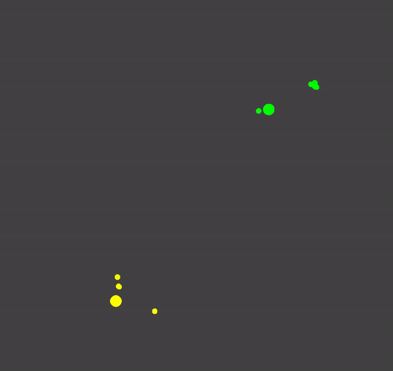

# Real-time Bayesian agents


In the above gif, the green dot represents a latent variable, the unseen but true position of a particle, which is moving stochastically around a 2D environment. 
What the system actually sees are the noisy observations shown in red.
The purple swarm represents the system's guess as to the true position of the particle at the current time.

Both the simulation and the inference run **in real time**, so this gif is just a short snippet of a live demo.


<!-- 
In this more complex scenario, you again see a green particle move around stochastically, now inside a box. This time, there are no observations at first, so the system is uncertain about the position. It is also uncertain about whether the particle is green or red, as shown at the bottom.
After a few seconds, the system receives the statement "The particle is in the box", and updates its beliefs accordingly. However, the probability about where the particle is in the box is still uncertain.
Then, the system starts to receive noisy observations of the position, and the uncertainty decreases again.
Finally, it receives the statement "The particle is green", and so resolves its remaining uncertainty.  -->



In this case, there are two agents (corresponding to the big yellow and green circles). Each moves stochastically, but with a bias to move away from the other. However, the catch is that each agent doesn't *know* the position of the other, so they have to infer the position from noisy observations and move away from the expectation of that inferred position.

# The code

The code is written in a *probabilistic programming library* in the functional programming language Haskell. The model for the first example looks like this:

```haskell
prior :: SignalFunction Stochastic () Position
prior = proc _ -> do
  x <- walk1D -< ()
  y <- walk1D -< ()
  returnA -< V2 x y

  where 

    walk1D :: SignalFunction Stochastic () Double
    walk1D = proc _ -> do
      dacceleration <- constM (normal 0 8 ) -< ()
      acceleration <- decayingIntegral 1 -< dacceleration
      velocity <- decayingIntegral 1 -< acceleration -- Integral, dying off exponentially
      position <- decayingIntegral 1 -< velocity
      returnA -< position
```


The `prior` describes the system's prior knowledge of how the green particle moves. Note that `prior` is a *time-varying* distribution, i.e. a stochastic process. This is reflected in the type of `prior`. Next, the generative model:

```haskell
observationModel :: SignalFunction Stochastic Position Observation
observationModel = proc p -> do
    (x,y) <- (noise &&& noise) -< ()
    returnA -< p + V2 x y
    where noise = constM (normal 0 std)
```

`observationModel` generates a process describing observations *given* the process describing the true position. Again, this is reflected in its type. Then the posterior:

```haskell
posterior :: SignalFunction (Stochastic & Unnormalized) Observation Position
posterior = proc (V2 oX oY) -> do
  latent@(V2 trueX trueY) <- prior -< ()
  observe -< normalPdf oY std trueY * normalPdf oX std trueX
  returnA -< latent
```

Given a process representing incoming observations, `posterior` is a process representing the inferred position of the particle. We cannot sample from it yet, because it is unnormalized.

```haskell
inference :: SignalFunction Stochastic Observation [(Position, Weight)]
inference =  particleFilter params {n = 100} posterior
```

The `particleFilter` inference method takes an unnormalized signal function (here the posterior), and produces a (normalized) signal function representing the position of a set of particles and their corresponding weights, given the observations. This is what we sample from to obtain the purple particles shown in the first gif above.

Finally, we wrap the whole system in a signal function that expresses the behavior to be displayed to screen:

```haskell
main :: SignalFunction Stochastic Text Picture
main = proc message -> do
  actualPosition <- prior -< ()
  measuredPosition <- observationModel -< actualPosition
  samples <- particleFilter params posterior -< measuredPosition
  (showObs, showParts) <- interpretMessage -< message
  renderObjects -< Result 
    (if showObs then measuredPosition else 0) 
    actualPosition 
    (if showParts then samples else [])
```

## Multiple agents

For the code with multiple agents, we can define them in a mutually recursive fashion:

```haskell
main :: SignalFunction (Stochastic & Feedback) Text Picture
main = proc inputText -> do
  rec
    ballObs1 <- iPre 0 >>> observationModel -< ball1
    inferred1 <- particleFilter params {n = 20} posterior -< (ball2, ballObs1)
    expectedBall1 <- arr expected -< inferred1
    ball2 <- iPre 0 >>> moveAwayFrom -< expectedBall1


    ballObs2 <- iPre 0 >>> observationModel -< ball2
    inferred2 <- particleFilter params {n = 20} posterior -< (ball1, ballObs2)
    expectedBall2 <- arr expected -< inferred2
    ball1 <- moveAwayFrom -< expectedBall2

  pic1 <- renderObjects yellow -< Result ballObs1 ball1 inferred1
  pic2 <- renderObjects green -< Result ballObs2 ball2 inferred2
  returnA -< pic1 <> pic2
```

Here, the position of `ball2` (the green ball) moves away (stochastically) from the expected position of ball 1 (`expectedBall1`), which depends on the posterior inference of ball1's position (`inferred1`) given the observation (`ballObs1`), which is produced from the position of `ball1`. `ball1` depends on `ball2` in the same fashion. 

# The approach

This is all implemented using a combination of (1) a paradigm for representing Bayesian probability and inference known as **probabilistic programming**, and (2) a paradigm for representing real-time interactive systems known as (functional) **reactive programming**.

There are several appealing aspects to this approach:

- it offers a natural representation for continuous time stochastic processes. Time is continuous in the sense that you write code that is agnostic to the final sampling rate of the whole system.

- it allows for these processes to be run indefinitely long without concerns about time or space leaks.

- it decouples the specification of the prior and posterior from the inference algorithm. For example, in the code for the above gif, the latent variable is described by a prior (which is a stochastic process) and the posterior is described by a (causal) stochastic function from the stream of observations to the latent variable.

<!-- - inference methods can be designed compositionally in a similar manner to standard probabilistic programming languages. For example, we may want to add MH moves at various points, or to adaptively change the population size or resampling rate. These extensions fit naturally into the approach. -->

- it allows for data to come from multiple streams, at different rates, or even from user input.

- it allows for Bayesian decision problems to be formulated. For example, one might want to take actions in real time, based on the current belief state, which would in turn influence incoming data.

# Functional reactive probabilistic programming: the details

Monad-bayes is great at handling **distributions** in a pure and functional manner, but doesn't have a good model of **time**. However, there are packages which can handle **time** in a pure and functional way, but don't know about **distributions**.

As such, it turns out that there is a beautiful synergy between approaches to modeling time (specifically real-time interactive processes) known as *reactive programming* (FRP) and probabilistic programming.

More soon.

