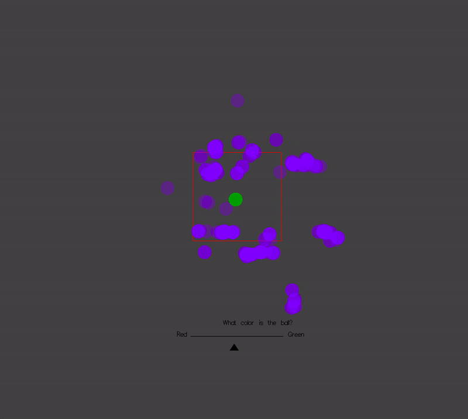

# Real Time Inference


In the above gif, the green dot represents a latent variable, the unseen but true position of a particle, which is moving stochastically around a 2D environment. 
What the system actually sees are the noisy observations shown in red.
The purple swarm represents the system's guess as to the true position of the particle at the current time.

Both the simulation and the inference run **in real time**, so this gif is just a short snippet of a live demo.




In this more complex scenario, you again see a green particle move around stochastically, now inside a box. This time, there are no observations at first, so the system is uncertain about the position. It is also uncertain about whether the particle is green or red, as shown at the bottom.

After a few seconds, the system receives the statement "The particle is in the box", and updates its beliefs accordingly. However, the probability about where the particle is in the box is still uncertain.

Then, the system starts to receive noisy observations of the position, and the uncertainty decreases again.

Finally, it receives the statement "The particle is green", and so resolves its remaining uncertainty.

# The code

The code is written in a *probabilistic programming library* in the language Haskell. The model for the first example looks like this:

```haskell
prior :: StochasticProcess Position
prior = fmap V.fromTuple $ model1D &&& model1D where

    model1D = proc _ -> do
        dacceleration <- constM (normal 0 8 ) -< ()
        acceleration <- decayingIntegral -< dacceleration
        velocity <- decayingIntegral -< acceleration -- Integral, dying off exponentially
        position <- decayingIntegral -< velocity
        returnA -< position
```


The `prior` describes how the system's `prior` knowledge of how the green particle moves.

```haskell
generativeModel :: ConditionalStochasticProcess Position Observation
generativeModel = proc p -> do
    n <- fmap V.fromTuple $ noise &&& noise -< ()
    returnA -< p + n
    where 
        noise = constM (normal 0 std)
```

The `generativeModel` generates a process describing observations given the process describing the true position.

```haskell
posterior :: UnnormalizedConditionalStochasticProcess Observation Position
posterior = proc (V2 oX oY) -> do
  latent <- prior -< ()
  predicted@(V2 trueX trueY) <- generativeModel -< latent
  arrM factor -< normalPdf oY std trueY * normalPdf oX std trueX
  returnA -< latent
```

Given a process representing incoming observations, the `posterior` is a process representing the inferred position of the particle. We cannot sample from it yet, because it is unnormalized.

```haskell
inference :: ConditionalStochasticProcess Observation [(Position, Weight)]
inference =  onlineSMC SMCConfig {numParticles = 100, resampler = resampleMultinomial} posterior
```

The `onlineSMC` inference method takes the posterior, and produces a normalized conditional stochastic process representing the position of a set of particles and their corresponding weights, given the observations.
# The approach

This is all implemented using a combination of (1) a paradigm for representing Bayesian probability and inference known as **probabilistic programming**, and (2) a paradigm for representing real-time interactive systems known as (functional) **reactive programming**.

There are several appealing aspects to this approach:

- it offers a natural representation for continuous time stochastic processes. Time is continuous in the sense that you write code that is agnostic to the final sampling rate of the whole system.

- it allows for these processes to be run indefinitely long without concerns about time or space leaks.

- it decouples the specification of the prior and posterior from the inference algorithm. For example, in the code for the above gif, the latent variable is described by a prior (which is a stochastic process) and the posterior is described by a (causal) stochastic function from the stream of observations to the latent variable.

<!-- - inference methods can be designed compositionally in a similar manner to standard probabilistic programming languages. For example, we may want to add MH moves at various points, or to adaptively change the population size or resampling rate. These extensions fit naturally into the approach. -->

- it allows for data to come from multiple streams, at different rates, or even from user input.

- it allows for Bayesian decision problems to be formulated. For example, one might want to take actions in real time, based on the current belief state, which would in turn influence incoming data.

# Functional reactive probabilistic programming: the details

Monad-bayes is great at handling **distributions** in a pure and functional manner, but doesn't have a good model of **time**. However, there are packages which can handle **time** in a pure and functional way, but don't know about **distributions**.

As such, it turns out that there is a beautiful synergy between approaches to modeling time (specifically real-time interactive processes) known as *reactive programming* (FRP) and probabilistic programming.

More soon.

