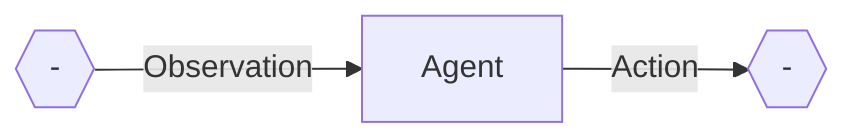
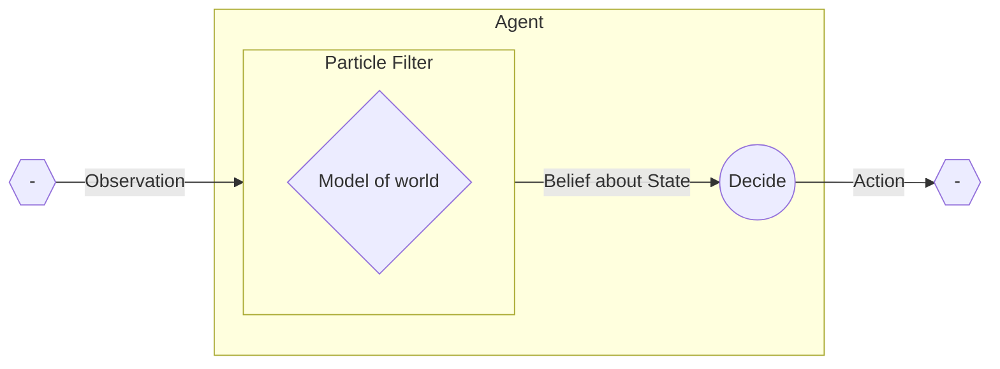
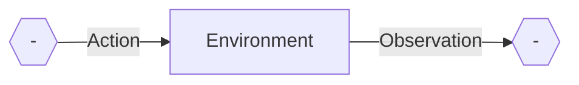
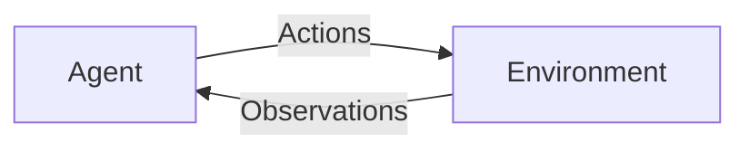
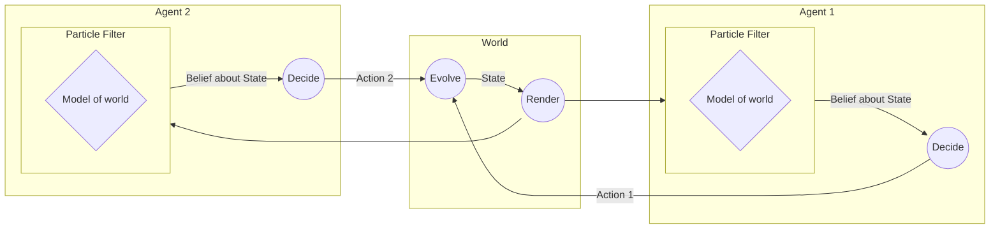
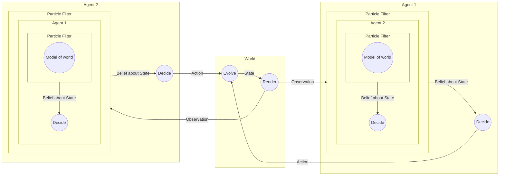
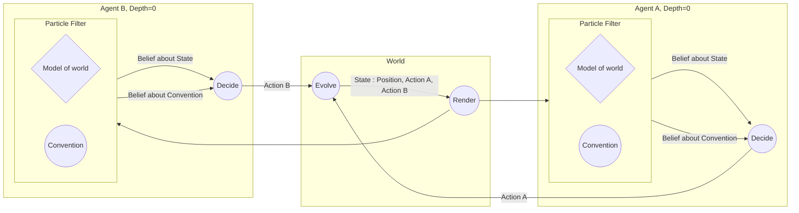

## Agents as stochastic dynamical systems



We can define an agent as a stochastic dynamic system (i.e. causal stochastic signal function) that takes a time varying stream of `Observation`s and produces a time varying stream of `Action`s.

In code, 

```haskell
type Agent = Observation >--> Action
```

Internally, the agent, if it is Bayesian, runs a particle filter to determine the state of the world, and some sort of utility-based decision process to determine actions.




In code:

```haskell
agent :: Agent
agent = decision . (particleFilter posterior)
```

## Agents as systems coupled to the environment

The world external to the agent (environment) can be modelled also as a dynamical system:



or

```haskell
type World = Action >--> Observation
```

So we can couple the two:



Or in code:

```haskell
example :: () >--> (Action, Observation)
example = proc () -> do
    rec
        observation <-world-< action
        action <-agent-< observation

    returnA -< (action, observation)
```

Here, the agent and the world are mutually dependent on the other; neither is defined without the other.

??? Complications

    Already here, there are some challenging subtleties to consider. For example, if the `agent` is Bayesian, then what model of the world is it using as its generative model? `world` is not quite right, because it is not itself coupled to `agent`, so really we want the generative model inside the agent to be:

    ```haskell
        worldIntegrated :: Action >--> Observation
        worldIntegrated = proc action -> do
        rec
            observation <-world-< action 
            action <-agent-< observation
        returnA -< observation
    ```

    This can't be quite right either, because the agent knows its own past actions, so this doesn't incorporate enough information.

    I'm still not quite sure on the correct approach.

## Multiple agents

For the code with multiple agents, things get more complex, but also more interesting.



??? Synchronicity

    We might also try to have an asynchronous version of this setup, where the two agents (and the world) run on separate clocks.

Here, there are two agents, each coupled to the environment. Marginalizing over the past induces a coupling between the two agents, which is to say that the actions of one agent at one time influence the other at future times and vice versa. 

## Convention and language

This is a nice setting in which to explore language and coordination. In particular, there is a need for each agent to model the other, which creates a difficult hall of mirrors effect, since agent 1 needs to model agent 2 modeling agent 1, modeling agent 2...

Note the nested inference here: in order for agent 1 to model agent 2, agent 1 must actually simulate the process of inference that agent 2 does.

People familiar with the Rational Speech Acts model (which is just the two agent probabilistic model in a non-time-varying setting) will be aware of the solution of assuming a base case to the recursion. That is, agent 1 might model agent 2, but agent 1's model of agent 2 is simple: it has no model of agent 1.

Here's a diagram of such a system:



We can also express this in code, to be more precise:

```haskell

example :: () >--> (Observation, AgentAction i, AgentAction (Other i))
example = proc _ -> do
  rec
    observation <- trueWorldModel -< (action1, action2)
    action1 <- cleverAgent one -< observation
    action2 <- cleverAgent two -< observation
  returnA -< (observation, action1, action2)

cleverAgent :: AgentID i -> Observation >--> AgentAction i
cleverAgent agentID = proc obs -> do
  belief <- particleFilter params (cleverPosteriorDistribution agentID) -< obs
  action <- cleverActionModel agentID -< belief
  returnA -< action

  where

    cleverPosteriorDistribution :: AgentID i -> Observation >-/-> State
    cleverPosteriorDistribution agentID = proc obs -> do
      latent <- cleverPriorDistribution agentID -< undefined
      observe -< (normalPdf2D obs 1 latent)
      returnA -< latent

    -- here is where the complexity resides. Note that `simpleAgent` is the agent that doesn't reason about the other.
    cleverPriorDistribution :: forall i. AgentID i -> AgentAction i >--> State
    cleverPriorDistribution agentID = feedback initialAction proc (myAction, otherAgentAction :: AgentAction (Other i)) -> do
        state <- trueWorldModel -< case agentID of
            SOne -> (myAction, otherAgentAction)
            STwo -> (otherAgentAction, myAction)

        obs <- observationModel -< state
        newOtherAgentAction <- simpleAgent (other agentID) -< obs

        returnA -< (state, newOtherAgentAction)
```

??? Details

    We've done some slightly sophisticated things in this code. In particular, rather than write agent 1 and agent 2 separately, we just have a general `Agent i`. Dependent types are used to make this work. 

We can think of the simple agent's prior in the Rational Speech Acts (RSA) terminology, as representing the *convention* between the two agents. (Similarly in RSA, the prior of the $L0$ more or less corresponds to the notion of a convention).


## The evolution of convention

A natural question to ask is: how does a convention evolve? One way of modeling this is to have each agent be uncertain about the prior of the other agent:



On the [next page](/convention), a concrete example is shown.
