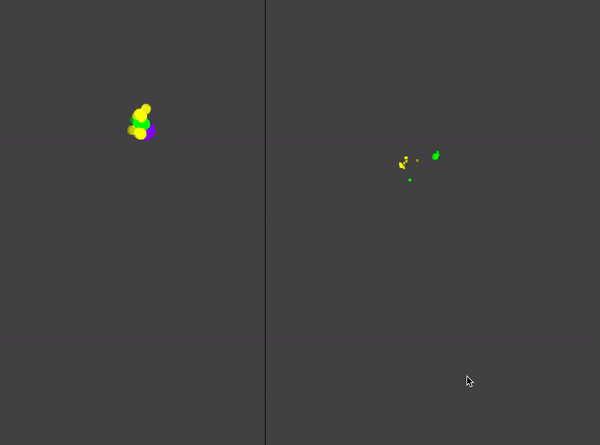

## Convention and coordination

Let's consider a specific example.

On the right side of the screen, we see a purple ball moving around. The smaller purple dots are noisy observations. There are two agents at work, each of which sees the noisy observations, and produces the guess of the purple ball's position, shown in yellow and green respectively.

The twist is that the two agents can send messages to each other. But to do so, they need a "language". In particular, at each point in time, each sends the other a 2D vector (x,y), representing the position of the object. The language consists of a vector added to this (representing the coordinate frame, if you like). 

Each agent has their own belief about what this language is, inferred simultaneously with the position of the ball, shown on the right-hand side of the screen, and yellow and green respectively. 

A simple but interesting consequence of this setup is that conventions align. That is, the "language" or "convention" that agents 1 and 2 infer tend to converge, which is to say that the right hand yellow swarm and the right hand green swarm occupy a similar position. (This is particularly clear to see when you turn communication off, at which point the conventions diverge).

In the model (described in more detail [here](/agents)), this is the consequence of the following (bolded): 

1. Each agent gets information both from observations and from signals from the other agent, **which they assume are unbiased descriptions of the state, encoded according to a convention**. This means that they can jointly infer the true state of the system *and* the convention, in a way that maximizes the probability of the signal given the convention.

2. Each agent uses **the same convention to decode an incoming signal and to encode an outgoing signal**.  

3. That is, agent 1 **jointly infers a convention C** and the state of the world, and then uses C to encode their own signal S. Then agent 2 infers a convention C' (which is biased towards C), based on this signal and observation, and produces a signal S'. Agent 1 then updates their inference based on C', which in turn was based on C. That is, there is a self reinforcing dynamic that makes conventions align without any absolute notion of the "correct" or "true" convention.

These seem to me like pretty intuitive (but not totally trivial) hypotheses about how conventions evolve, and I wonder how they can be connected to data.

One kind of prediction that this class of models make is that as the number of agents increases, conventions become harder to change.

## Origin of convention

A second question concerns how a convention actually forms in the first place. That is, if one does not build into a model the specific assumption that an agent should encode and decode with a convention, how can one arise, especially one as stable and complex as any human language.

The question of how complexity arises is actually less mysterious to me, since it is clear that the models of agents described above have a self-reinforcing dynamic, where any structure an agent starts to believe exists gets reflected back into reality. 

But the second question, of how a convention comes to exist without being hardwired seems much more subtle and interesting.