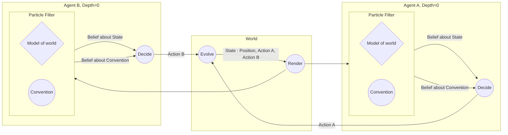
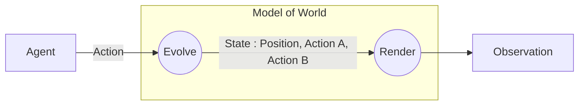
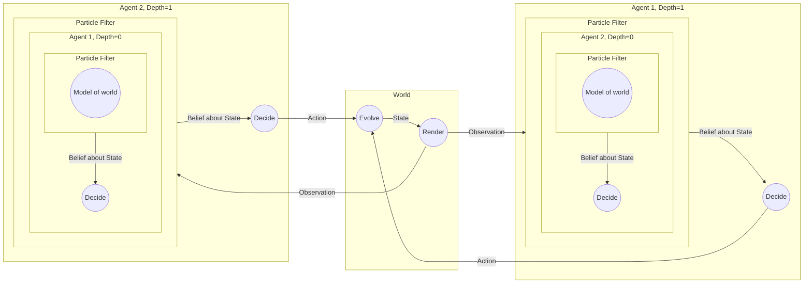

# Project

High level idea: there's some new work on [real-time Bayesian inference](todo) which I've been working on extending.

This approach makes is substantially easier to write stochastic dynamics systems with feedback and online Bayesian inference. In particular, in makes it much easier to write nested SMC, that is, running SMC on a model which includes a complement that is the result of running SMC.

These are precisely the elements that make it tractable to build models of real-time Bayesian agents interacting. For that reason, I've been getting interested in models of communication, to get some theoretical handles on the questions of how and when conventions emerge and evolve.

## Evolution of convention

A simple but interesting consequence of this model is that conventions align. That is, the convention that agents 1 and 2 infer tend to converge.

In the model, this is the consequence of the following (bolded): 

1. Each agent gets information both from observations and from signals from the other agent, **which they assume are unbiased descriptions of the state, encoded according to a convention**. This means that they can jointly infer the true state of the system *and* the convention, in a way that maximizes the probability of the signal given the convention.

2. Each agent uses **the same convention to decode an incoming signal and to encode an outgoing signal**.  

3. That is, agent 1 **jointly infers a convention C** and the state of the world, and then uses C to encode their own signal S. Then agent 2 infers a convention C' (which is biased towards C), based on this signal and observation, and produces a signal S'. Agent 1 then updates their inference based on C', which in turn was based on C. That is, there is a self reinforcing dynamic that makes conventions align without any absolute notion of the "correct" or "true" convention.

These seem to me like pretty intuitive (but not totally trivial) hypotheses about how conventions evolve, and I wonder how they can be connected to data.

One kind of prediction that this class of models make is that as the number of agents increases, conventions become harder to change.

## Origin of convention

A second question concerns how a convention actually forms in the first place. That is, if one does not build into a model the specific assumption that an agent should encode and decode with a convention, how can one arise, especially one as stable and complex as any human language.

This is more of a work in progress, since I haven't quite yet settled on exactly the right model. Here is a sketch of the idea:

- no explicit convention exists, but rather, **agent 1 (depth=1) models (a version of) agent 2 (depth=0)** (and vice versa). This requires nested inference, ala RSA.
- **agent 1's model of agent 2, i.e. agent 2 at depth=0, does not itself model**. Rather it has some "model of nature" that excludes the other agent.
- Each agent at depth=1 performs **joint inference about the "model of nature"**, much like the joint inference about the convention in the previous model.

Predictions of this class of models

## Details

Coming up with a model that is simple enough to be tractable to accurately simulate, but complex enough to be interesting is pretty hard, and will probably require a few iterations.

Here is a detailed description of the current attempt. In what follows, everything is assumed to be time-varying. 

Rather than talking about conditional distributions $P(a|b)$, I refer to conditional stochastic processes $S(a(t)|b_{\leq t})$. The difference is just that the latter has $a$ and $b$ be functions of time, and the probability of $a(t)$ depend on all $b(t')$ for %t' \leq t$.

Note: I'm sure there's a more standard notation for this, happy to switch. I'll just write $S(a|b)$ for now, to mean what is described above.

    For example, in saying that the X is a Boolean variable, I really mean a time varying Boolean.

### View from nowhere

- State: a pair of Booleans
- Observation: a pair of Booleans
- Actions: one for each agent Agent i action: a pair of Booleans

- System: S(Observation | Actions). Expressed in two parts:
    - Evolve: S(newState | action, old_state)
    - Render: S(Observation| State)
- Agents 1 and 2: S(Action | Observation)

### View from the "natural" agent

- World model of type S(Observation|Action):
- Decisions: argmax_{Action} S(State|Action)

### View from the level-1 agent

- World model of type S(Observation|Action)

### View from the level-1 agent with joint inference

